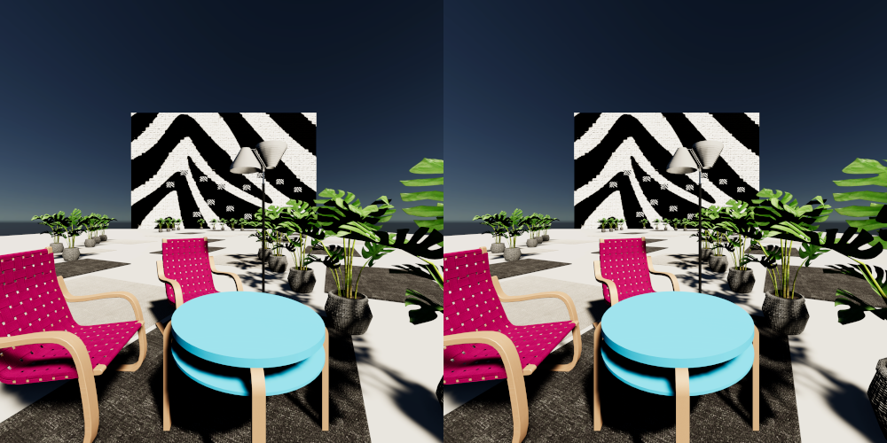
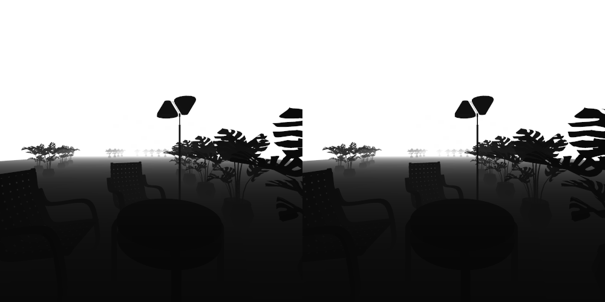
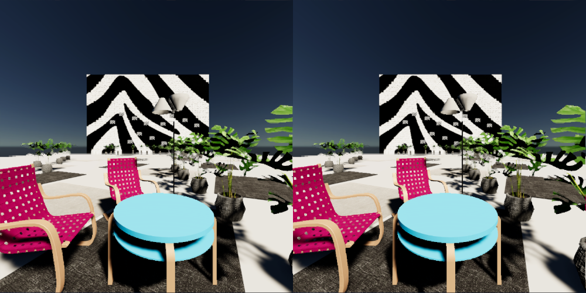

# 6DoF Image Viewer

This project is a 6 Degrees of Freedom (6DoF) stereo image viewer built in Unity, designed for viewing images in a VR headset. It allows users to explore stereo images with both translational movement and head rotation, addressing issues present in traditional 3DoF viewers, where head movement can lead to user discomfort.

This repository primarily serves to document my approach and may also provide a useful starting point for others interested in tackling this problem.

The following videos demonstrate the results of the viewer:

https://github.com/user-attachments/assets/94a7c8d0-e01d-41dc-aa63-1626a10f379f

https://github.com/user-attachments/assets/3939952a-0190-4fa8-b0c4-af154b6ca0dd

https://github.com/user-attachments/assets/f0339c28-11c7-44f2-9371-394bd54902c8

https://github.com/user-attachments/assets/6701b304-d128-4252-b457-b395bfc02b4f

## Input
The viewer uses three input images: a color image and a depth image, which are required for rendering, and an optional infilling image that can be used to improve the visual output.

### Color image
The stereo color image. In this example, the distance between the left and right cameras is 6 cm.

### Depth map
A 16-bit depth map providing depth information. Currently, values in the range 0–1 map linearly to a distance of 0–30 meters from the camera.

### Infill image
An optional infilling image used to improve rendering in areas behind foreground objects that would otherwise be obstructed.

## Rendering
Rendering is handled using a custom render pass. The process begins with raymarching through the input images for each pixel to determine and write out color and depth information. The resulting depth render target is then downsampled, and edge detection is applied to extract edge data. In the final step, the edge texture is used to refine the rendered image, applying supersampling around the edges to improve visual quality.

### Raymarching
Raymarching is divided into two phases:

- Coarse pass: We march through the depth map using relatively large steps (approximately 100 steps). Step size is adaptive — smaller near the camera and larger farther away.
- Refinement pass: Once a hit is detected, we step back slightly and perform a second pass using smaller steps (approximately 25 steps) to accurately determine the point of intersection.

In the video below, the refinement pass is disabled. The raymarching simply writes out the color at the first collision point, resulting in a visual effect where the image appears to be composed of distinct, visible slices. The video compares output using 0 refinement steps and 15 refinement steps. Even with just 15 refinement steps, the improvement is substantial — the layered appearance disappears, and the result looks significantly more natural and cohesive.

https://github.com/user-attachments/assets/1b1b2c39-615b-4d11-bfaa-3822d88018da

The refinement pass helps us avoid having to use a lot of steps. Still, it's not perfect, and using fewer steps can lead to edges getting stepped over. The same issue occurs with parallax occlusion mapping, and a good visual example can be found [here](https://shaderbits.com/blog/curved-surface-parallax-occlusion-mapping).

In the following video, the first 100 samples are used, followed by 1000 steps. The improvement around the edges is clearly visible.

https://github.com/user-attachments/assets/24fed789-0526-4d56-9a94-4002a6a00952

### Infilling
Using just the color image and a depth map, we lack information about what is behind objects. The current approach aims to fill in these areas with colors that are not distracting, without relying on the view from the other camera or inventing content that the camera did not capture.

Output without infilling to highlight the affected areas:

Sampling the regular color image for infilling essentially smears the color across the area:

Sampling the regular color image at a lower resolution for infilling looks better, but it essentially blends the foreground with the background.

Sampling the infilling texture. Foreground and background are not blended together and remain clearly distinct. The holes in the chair are still visible.

#### Infilling image

The infilling image is generated from the color image and the depth map. It essentially smears the background colors over the foreground objects. The image is also downsampled.

Comparison of the color image and the infilling image:

https://github.com/user-attachments/assets/da49a6fd-47a0-4aaf-834f-3a537f340354

## Scripts
- 'vr180 reprojection.py' is used to extract a perspective stereo image pair from VR180 images.

- 'image merger.py' is used to merge the extracted stereo image pairs into a single image.

## Limitations
### Depth map generation
For the depth map generation on real images I used [FoundationStereo](https://github.com/NVlabs/FoundationStereo).

Due to high memory usage, I am unable to generate high-resolution depth maps and am limited to images of approximately 1500×1500 pixels.

Another issue is that the model only generates a disparity map for the left image. To generate a disparity map for the right image, I had to rotate the images and switch their order (essentially simulating a 180-degree rotation of the stereo camera). This approach works to some extent, but the generated disparity maps can have differences.

Additionally, this model does not work on equirectangular images (used for VR180) and is limited to a smaller field of view than 180 degrees.

### Edges aliasing
### Thin objects

Depending on the step count used in raymarching, it is possible to step over thin objects.

### Performance

On an RTX 5070 Ti, I can use around 100 steps in the raymarching process and achieve 90 FPS in VR on a Quest 3. Using more steps or running this directly on a mobile VR headset will require further optimization.

### Reflective/transparent objects

The current approach does not handle transparent or reflective objects well, and there is no obvious solution for this yet.

## Future work
### Depth map generation
Currently, I am not aware of a method to generate depth maps for stereo 180-degree images. Existing models typically generate a single disparity map for the left image. A model that supports stereo images and outputs a depth map for each would be highly beneficial.

### Infilling with other camera view

### Video support

## Releases

A build can be downloaded under Releases.

The images come from https://deovr.com/channel/burari-vr?type=photos.

